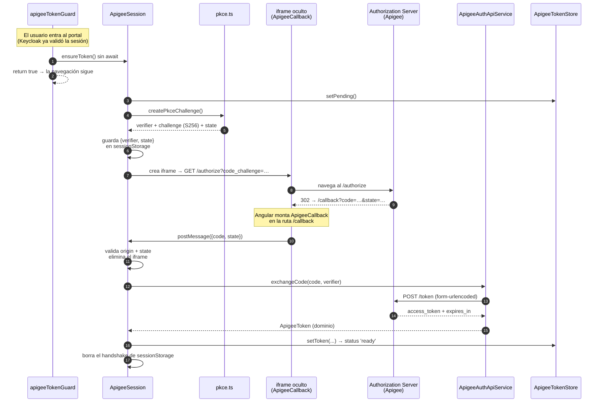

# Flujo de autenticación con Apigee (OAuth2 + PKCE)

Cómo el portal obtiene el token de acceso de Apigee: cómo inicia, qué componente
entra en acción en cada paso y por qué está armado así.

## 1. Qué resuelve

El portal habla con **dos proveedores de identidad independientes**:

| Proveedor | Qué autentica | Dónde se usa el token |
| --- | --- | --- |
| Keycloak | La sesión del usuario en el portal | Gateway de emisión (`environment.apiUrl`) |
| Apigee | La aplicación ante las APIs de Apigee | APIs de Apigee (`environment.apigee.apiUrl`) |

Los dos **coexisten**: Keycloak sigue siendo el login (lo fuerza
`provideKeycloak({ onLoad: 'login-required' })` en el bootstrap), y este flujo
solo consigue, en paralelo y sin interrumpir al usuario, el token adicional que
exigen las APIs de Apigee. El interceptor decide cuál adjuntar según el host de
cada petición.

La otra mitad —la sesión de Keycloak— vive en `features/auth/store/auth.store.ts`
y `features/auth/services/keycloak-session.ts`, y no se toca aquí.

El flujo implementa **Authorization Code + PKCE** (RFC 7636) en tres pasos:
`/authorize` → callback con el `code` → `/token`. Todo ocurre dentro de un
iframe oculto, así que el usuario nunca abandona la pantalla.

## 2. El recorrido completo



## 3. Cómo inicia

El disparador es **`apigeeTokenGuard`**
(`src/app/features/auth/guards/apigee-token-guard.ts`), encadenado después de
`authGuard` en `src/app/app.routes.ts`:

```ts
canActivate: [authGuard, apigeeTokenGuard],
```

Ese orden importa y sigue el escalonado de `ARCHITECTURE.md` §4: primero
Keycloak confirma que hay sesión, y recién entonces se busca el token de Apigee.

El detalle clave es que el guard **no espera** al flujo:

```ts
void inject(ApigeeSession).ensureToken();
return true;
```

Es deliberado. El token de Apigee habilita las APIs de ese proveedor, pero no
condiciona el acceso al portal; si el guard esperara, cualquier demora del
proveedor congelaría la navegación hasta el timeout y el usuario se quedaría
mirando una pantalla en blanco. Así que el guard solo **precalienta**: lanza el
trabajo para que el token ya esté listo cuando llegue la primera petición que lo
necesite. Quien de verdad garantiza el token es el interceptor (§4.6).

## 4. Los componentes, en orden de activación

### 4.1 `ApigeeSession` — el orquestador

`src/app/features/auth/services/apigee-session.ts`

Es el equivalente de `KeycloakSession` para este proveedor: la única puerta
imperativa del flujo. Su método público es `ensureToken()`, que **nunca lanza**:
atrapa cualquier fallo, lo registra y deja el store en `error`.

Antes de trabajar aplica dos cortocircuitos:

- Si `store.isValid()` ya es cierto, resuelve al instante.
- Si hay una vuelta en curso, reutiliza esa promesa (`inFlight`), de modo que
  varias peticiones simultáneas comparten un solo flujo en lugar de disparar uno
  cada una.

Después arma el `/authorize` con `HttpParams`, lo abre en un **iframe oculto** y
espera el `postMessage` de vuelta. Un `setTimeout` de `AUTHORIZE_TIMEOUT_MS`
(10 s) corta la espera si el callback nunca responde. Al recibir el mensaje
verifica que el `state` coincida con el guardado —protección CSRF: ata la
respuesta a la petición que la originó— y recién ahí canjea el code.

La limpieza está en un `finally`, así que el `code_verifier` se borra de
`sessionStorage` tanto si el flujo triunfa como si falla; y el listener de
`message` y el iframe se retiran en todos los caminos de salida, incluido el
timeout.

### 4.2 `pkce.ts` — las credenciales PKCE

`src/app/features/auth/services/pkce.ts`

Funciones puras, sin estado ni DI, por eso no es un servicio inyectable.
`createPkceChallenge()` devuelve el trío que consume `ApigeeSession`:

- **`verifier`**: 32 bytes de `crypto.getRandomValues` en base64url (43 chars,
  dentro del rango 43-128 que exige el RFC). Es el secreto.
- **`challenge`**: `base64url(SHA-256(verifier))` — el método `S256`. Es lo único
  que viaja en el `/authorize`.
- **`state`**: nonce anti-CSRF.

La gracia de PKCE: el `/authorize` solo ve el hash, y el secreto original recién
aparece en el `/token`. Quien intercepte el `code` no puede canjearlo sin el
verifier.

`crypto.subtle` exige **contexto seguro**: funciona bajo HTTPS y bajo
`http://localhost`, pero no si se sirve la app por IP de red
(`http://192.168.x.x:4200`), donde lanzará.

### 4.3 `ApigeeCallback` — la captura del code

`src/app/features/auth/pages/apigee-callback/apigee-callback.ts`, montado en la
ruta `/callback` de `src/app/app.routes.ts`.

Es el `redirect_uri`: el punto donde aterriza el 302 del proveedor, **dentro del
iframe**. Se declara sin guards a propósito — no es una pantalla del portal y no
debe pasar por la sesión de Keycloak.

Su único trabajo es leer `code`, `state` y `error` de la query y reenviarlos a la
ventana principal:

```ts
window.parent.postMessage(message, window.location.origin);
```

El `targetOrigin` es explícito, nunca `'*'`: el `code` no debe filtrarse a otro
origen. Del otro lado, `ApigeeSession` valida `event.origin` de forma simétrica.

No hace HTTP ni toca el store (`CONSTITUTION` §4): el canje ocurre en el parent,
que es quien tiene el `code_verifier`. El contrato del mensaje está tipado en
`models/apigee-callback-model.ts` (`APIGEE_CALLBACK_MESSAGE` +
`isApigeeCallbackMessage`), para no confundirlo con mensajes de terceros.

### 4.4 `ApigeeAuthApiService` — el canje

`src/app/features/auth/services/apigee-auth-api.ts`

Única puerta HTTP contra el Authorization Server (`CONSTITUTION` §1, §4). Solo
transporta y mapea; no orquesta ni guarda estado.

`exchangeCode(code, verifier)` hace `POST /token` con el body armado con
`HttpParams` — pasarlo así hace que Angular ponga el
`application/x-www-form-urlencoded` que el endpoint exige — y mapea el DTO crudo
al modelo de dominio, resolviendo `expires_in` (segundos) a un `expiresAt`
absoluto en epoch ms.

### 4.5 `ApigeeTokenStore` — el estado

`src/app/features/auth/store/apigee-token.store.ts`

`signalStore` `providedIn: 'root'` con estado **síncrono** (`ARCHITECTURE` §2):
sin HTTP ni `rxMethod`. Expone `accessToken`, `refreshToken`, `expiresAt` y
`status` (`idle | pending | ready | error`), y un `isValid` computado que
descuenta `EXPIRY_SKEW_MS` (30 s) para no usar un token que vence mientras la
petición viaja.

Solo `ApigeeSession` lo hidrata, mediante `setPending()`, `setToken()` y
`setError()` — el `patchState` queda encapsulado dentro del store, igual que en
`AppointmentFiltersStore`.

Los tokens viven **solo en memoria**: al recargar la página el flujo se repite,
que es silencioso.

### 4.6 `authInterceptor` — el reparto

`src/app/core/interceptors/auth-interceptor.ts`

Decide qué token adjuntar según el destino, en este orden:

1. **`apigee.authUrl`** (el `/token`): pasa sin tocar. Se autentica con el
   `code_verifier` en el body y un Bearer lo rompería. Esta rama va primero
   porque `authUrl` empieza con `apiUrl`, y sin ella la siguiente se la comería.
2. **`apigee.apiUrl`**: aquí **sí se espera** `ensureToken()`. Es el punto donde
   el token hace falta de verdad, y la espera es barata: resuelve al instante si
   ya hay uno vigente (el guard lo precalentó) y deduplica si hay un flujo en
   curso. Si falla, la petición sale sin Bearer y deja que el proveedor responda
   401.
3. **Cualquier otra cosa**: la lógica original de Keycloak, intacta — Bearer
   desde `keycloak.token` solo hacia `environment.apiUrl`. Los assets locales
   (mocks) quedan fuera.

## 5. Detalles que no se ven en el código

**Por qué `app.config.ts` no siempre provee Keycloak.** El iframe carga
`/callback`, y eso bootstrapea la app Angular entera otra vez. Sin protección,
`onLoad: 'login-required'` se redispararía dentro del iframe y el flujo entraría
en bucle. De ahí la guarda:

```ts
const isApigeeCallbackFrame =
  window.self !== window.top && window.location.pathname === '/callback';
```

**Por qué el `code_verifier` va a `sessionStorage`.** El iframe *navega* a otro
origen y vuelve, así que la memoria del `ApigeeSession` original no sirve como
puente: el verifier tiene que sobrevivir a esa navegación. Es el único dato que
se persiste, bajo `HANDSHAKE_KEY`, y se borra en cuanto se canjea. Los tokens no
se persisten en ningún lado.

**Dónde se parametriza todo.** El bloque `apigee` de
`src/environments/environment.ts` (dev) y `environment.production.ts` (prod, vía
`fileReplacements` en `angular.json`): `authUrl`, `apiUrl`, `clientId`,
`redirectUri`, `scope` e `idp`. El `redirectUri` cambia por entorno; el resto hoy
coincide.

## 6. Qué pasa cuando algo falla

Cualquier fallo —proveedor caído, timeout, `state` que no coincide, framing
bloqueado— termina igual: `ApigeeSession` lo atrapa, escribe un `console.error`
con `[apigee]` y deja el store en `status: 'error'` con los tokens en `null`,
descartando cualquier residuo de un intento previo.

La navegación **nunca se interrumpe**. El portal carga con normalidad; lo único
que queda inhabilitado es llamar a las APIs de Apigee, que responderán 401 al no
recibir Bearer. Un reintento ocurre solo cuando algo vuelva a llamar a
`ensureToken()` (otra navegación o una nueva petición a Apigee).
